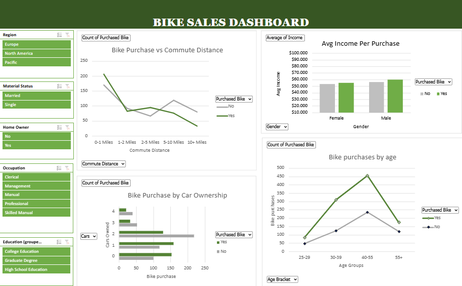

# Excel.bike_purchases_analysis
In this project, bike purchase behavior across different regions was analyzed. The dataset was cleaned, pivot tables were created, and an interactive dashboard was built to explore key patterns such as average income per purchase, age groups, and car ownership

## Dashboard Preview

